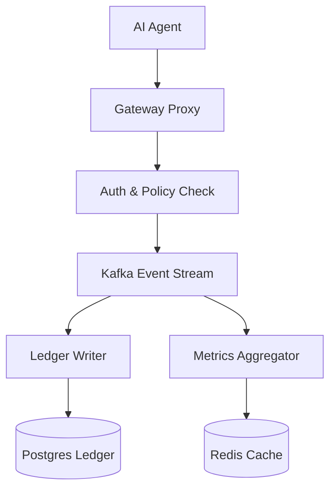

# Caracal: Network-Enforced Policy & Metering

  

Caracal provides a robust, network-enforced policy enforcement and metering layer for AI agents. It ensures that agents operate within defined economic boundaries and provides cryptographic proof of all spending events.

---

## ⚡ Key Features

- **Network-Level Enforcement**: Policies are enforced at the network proxy level, preventing any unchecked spending or resource access.
- **Cryptographic Integrity**: All metering events are recorded in a Merkle tree-backed ledger with ECDSA signing.
- **Fail-Closed Semantics**: By default, any error in policy evaluation or connection results in a denial of resource access.
- **Model Agnostic**: Works with OpenAI, Anthropic, and custom MCP-compatible servers.
- **Real-Time Metering**: High-performance Redis-backed metrics aggregation for instant spending visibility.

## 🚀 Getting Started

New to Caracal? Follow these steps to get up and running:

1.  **[Introduction](./index.md)**: Understand the core concepts and architecture.
2.  **[Quickstart](./quickstart.md)**: Deploy a local development environment in minutes.
3.  **[Deployment Guide](./guides/DEPLOYMENT_GUIDE_V03.md)**: Detailed instructions for various environments.
4.  **[SDK Reference](./sdk.md)**: Learn how to integrate Caracal into your Python applications.

## 🏛 Architecture Overview

Caracal is built with a high-performance, event-driven architecture:

## 🤝 Community & Support

- **GitHub**: [Garudex-Labs/Caracal](https://github.com/Garudex-Labs/Caracal)
- **Discord**: Join our [community server](https://discord.gg/caracal)
- **Email**: [support@caracal.dev](mailto:support@caracal.dev)
- **Issues**: [Report a bug](https://github.com/Garudex-Labs/Caracal/issues)
